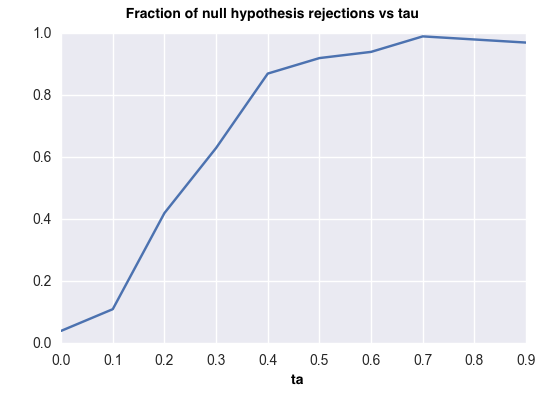

# Ising Model Statistical Test Implementation

This is an implementation of the paper ["Concentration of Multilinear Functions of the Ising Model with Applications to Network Data"](https://nurture.ai/p/5a328a78-d6ec-46af-b11c-ce81462a13e9). This is a submission for Nurture.ai's [Global NIPS Paper Implementation Challenge](https://nurture.ai/nips-challenge).

The implementation can be found [in this notebook](https://github.com/marianneke/ising/blob/master/NIPS_Ising.ipynb).

## Summary of results

The [notebook](https://github.com/marianneke/ising/blob/master/NIPS_Ising.ipynb) contains code that
- Generates samples of Ising lattices with nearest-neighbor interaction under zero magnetization using MCMC
- Generates samples that depart from an Ising model in the high-temperature limit, with the departure parameterized by a variable &tau;
- Performs a hypothesis test on these samples using a statistic introduced in the paper, where the null hypothesis is that the sample is an Ising lattice in the high-temperature limit
- Reproduces the result from the paper, where the percentage of successful rejections of the null hypothesis is plotted against &tau; (see plot below)

